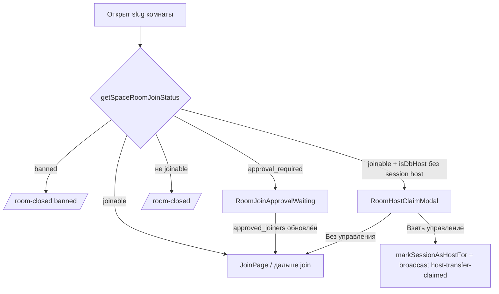
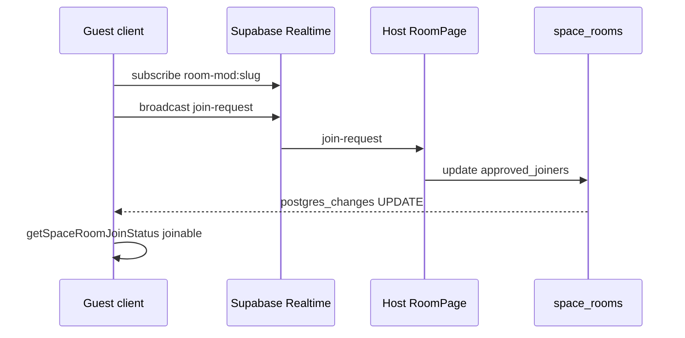

# Модерация space-комнат: бан, кик, одобрение входа, перехват хоста

Документ описывает текущую реализацию (клиент + Supabase). Часть сценариев зависит от **сигнального сервера** (Socket.IO): без обработки `hostKickPeer` кик из UI не отключит участника.

---

## Данные в БД (`space_rooms`)

| Поле | Назначение |
|------|------------|
| `banned_user_ids` | Массив UUID пользователей Supabase Auth, которым запрещён вход в эту комнату. |
| `approved_joiners` | Массив UUID пользователей, которым хост **разрешил один вход** при `access_mode = 'approval'`. После успешного входа запись можно убрать (см. `removeSpaceRoomApprovedJoiner` — используется при отклонении; повторное одобрение при следующем визите — снова через панель хоста). |
| `access_mode` | Режим доступа: `link` (по умолчанию при создании), `approval` (вход только после добавления в `approved_joiners`), `invite_only` (сейчас клиент трактует как «нельзя по ссылке» → экран как у истёкшего приглашения). |
| `host_user_id` | Владелец строки комнаты в БД; совпадение с `user.id` даёт «DB-хоста». |

Миграция: `supabase/migrations/20260418120000_space_room_moderation.sql`.

---

## Проверка «можно ли зайти»: `getSpaceRoomJoinStatus`

Файл: [`src/lib/spaceRoom.ts`](../src/lib/spaceRoom.ts).

Порядок логики (упрощённо):

1. Пустой slug → `closed_or_missing`.
2. Если в этой вкладке уже отмечен хост (`sessionStorage`: `vmix_i_am_host_for`) или висит «ожидающий клейм хоста» (`vmix_pending_host_claim`) → **joinable**, без проверки БД (как раньше для создателя/ожидающего регистрации).
3. Чтение строки `space_rooms` по `slug`. Нет строки / `status !== 'open'` → `closed_or_missing`.
4. Если пользователь в `banned_user_ids` → `banned`, не joinable.
5. Если `authUserId === host_user_id` → joinable, `isDbHost: true` (хост всегда может войти, пока комната открыта).
6. Если `access_mode === 'approval'`: joinable только если `authUserId` есть в `approved_joiners`; иначе `approval_required`.
7. Если `access_mode === 'invite_only'` → не joinable, denial как `invite_expired` (тот же UX, что у «закрытого окна» ссылки).
8. Для `link` + временной комнаты без `retain_instance` — проверка возраста `created_at` (окно минут из `SPACE_ROOM_TEMPORARY_INVITE_MINUTES`).

Возвращаемое значение: `{ joinable, denial, isDbHost }`.

---

## Маршрутизация до входа в комнату: `RoomSession`

Файл: [`src/components/RoomSession.tsx`](../src/components/RoomSession.tsx).

После `getSpaceRoomJoinStatus`:

- **`approval_required`** → экран [`RoomJoinApprovalWaiting`](../src/components/RoomJoinApprovalWaiting.tsx), а не `/room-closed`.
- **`banned`** → `/room-closed` с `state.reason: 'banned'`.
- **`invite_expired`** и прочие «закрыто» → `/room-closed` с нужным `reason`.
- Если **joinable** и пользователь **DB-хост** (`isDbHost`), но **нет** флага сессии хоста (`vmix_i_am_host_for`) и **нет** `vmix_pending_host_claim` → показывается [`RoomHostClaimModal`](../src/components/RoomHostClaimModal.tsx) (новое устройство / новая вкладка).

Иначе показывается обычный [`JoinPage`](../src/components/JoinPage.tsx).

---

## Перехват управления хостом (`RoomHostClaimModal`)

Сценарий: владелец комнаты в БД открыл slug с другого места, где не выставлен `sessionStorage` хоста.

- **«Взять управление здесь»** — вызывается `markSessionAsHostFor(slug)` и отправляется **Supabase Realtime Broadcast** на канал `room-mod:{slug}`, событие `host-transfer-claimed`.
- **«Войти без управления»** — модал закрывается, пользователь остаётся обычным участником (в `handleJoin` `canManageRoom` будет false, если нет админ-прав).

На **старом устройстве**, где уже открыта [`RoomPage`](../src/components/RoomPage.tsx), подписка на тот же канал ловит `host-transfer-claimed`, вызывает `clearHostSessionIfMatches(slug)` и показывает тост «управление перенесено».

Важно: это **синхронизация UI и sessionStorage между вкладками/устройствами**, а не отключение медиа-сессии на старом клиенте автоматически.

---

## Ожидание одобрения (`RoomJoinApprovalWaiting`)

Файл: [`src/components/RoomJoinApprovalWaiting.tsx`](../src/components/RoomJoinApprovalWaiting.tsx).

1. Подписка на `room-mod:{slug}`.
2. После `SUBSCRIBED` отправляется broadcast `join-request` с полями `requestId`, `userId`, `displayName` (сейчас в `displayName` уходит `document.title` — заголовок вкладки, не имя с экрана входа).
3. Параллельно подписка на **postgres_changes** `UPDATE` по `space_rooms` с фильтром `slug=eq.{slug}`. При обновлении снова вызывается `getSpaceRoomJoinStatus`; если стало `joinable` → `onApproved()` и пользователь возвращается к обычному потоку (JoinPage).
4. Fallback: опрос `getSpaceRoomJoinStatus` каждые 15 с.
5. Событие `join-request-denied` (broadcast) переводит в состояние «запрос отклонён».

**Ограничение:** режим `access_mode = 'approval'` в интерфейсе создания комнаты пока не переключается — строка в БД должна быть выставлена вручную или через отдельный вызов [`updateSpaceRoomAccessMode`](../src/lib/spaceRoom.ts). Для одобрения гостю нужен **известный `userId`** (авторизованный пользователь); анонимы в `approved_joiners` не попадают.

---

## Панель запросов у хоста (`RoomPage`)

Только если `useIsDbSpaceRoomHost` = true:

- Те же broadcast `join-request` попадают в локальный стейт `joinRequests`.
- **Впустить** → [`approveSpaceRoomJoiner(slug, hostUserId, targetUserId)`](../src/lib/spaceRoom.ts) — UUID добавляется в `approved_joiners`.
- **Отклонить** → [`removeSpaceRoomApprovedJoiner`](../src/lib/spaceRoom.ts) (на случай если UUID уже был в списке) + broadcast `join-request-denied`.

---

## Кик и бан

### Клиент → сигнальный сервер

Файл: [`src/hooks/useRoom.ts`](../src/hooks/useRoom.ts).

- `requestKickPeer(targetPeerId)` шлёт **`hostKickPeer`** с `{ roomId, targetPeerId }`.
- Ожидается, что сервер найдёт сокет участника и отправит ему событие **`kicked`** (или закроет комнату с `roomClosed` / `reason: 'kicked'`).

Клиент слушает:

- `kicked` → `RoomClosedReason = 'kicked'`, выход из комнаты, редирект на [`RoomClosedPage`](../src/components/RoomClosedPage.tsx).
- `roomClosed` с `reason: 'kicked'` — то же.

**Без реализации `hostKickPeer` на сервере кнопки кика не имеют эффекта на удалённого участника.**

### Бан в БД + кик

В контекстном меню плитки (через [`SrtCopyMenu`](../src/components/SrtCopyMenu.tsx)) для **DB-хоста** и участника с **`authUserId`**:

- **«Выгнать из комнаты»** — только `requestKickPeer` (если сервер поддерживает).
- **«Выгнать и заблокировать»** — [`banUserFromSpaceRoom`](../src/lib/spaceRoom.ts) (добавление UUID в `banned_user_ids`) и затем `requestKickPeer`.

Повторный вход забаненного пользователя блокируется на этапе `getSpaceRoomJoinStatus` → `/room-closed` с `reason: 'banned'`.

---

## Session storage ключи

| Ключ | Назначение |
|------|------------|
| `vmix_i_am_host_for` | Slug комнаты, для которой эта вкладка считается «сессионным хостом» (управление комнатой, конец для всех и т.д. в связке с планом/ролями). |
| `vmix_pending_host_claim` | Slug, по которому при первом join будет вызван `registerSpaceRoomAsHost`. |

Константы: `HOST_SESSION_KEY`, `PENDING_HOST_CLAIM_KEY` в [`spaceRoom.ts`](../src/lib/spaceRoom.ts).

---

## Сводная схема потоков

---

## Что проверить при доработках

1. **RLS Supabase** — хост должен иметь право обновлять `banned_user_ids`, `approved_joiners`, `access_mode` только для своих строк (`host_user_id`).
2. **Сигнальный сервер** — обработчики `hostKickPeer` и рассылка `kicked`.
3. **Режим approval** — переключатель `access_mode` в UI хоста (сейчас функция в `spaceRoom.ts` есть, экрана переключения может не быть).
4. **Очистка `approved_joiners`** после входа гостя (по желанию): сейчас UUID может остаться в массиве до ручного удаления или отклонения.
